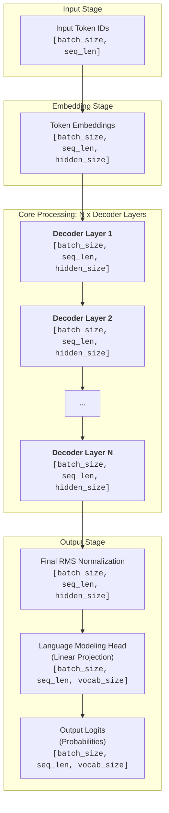
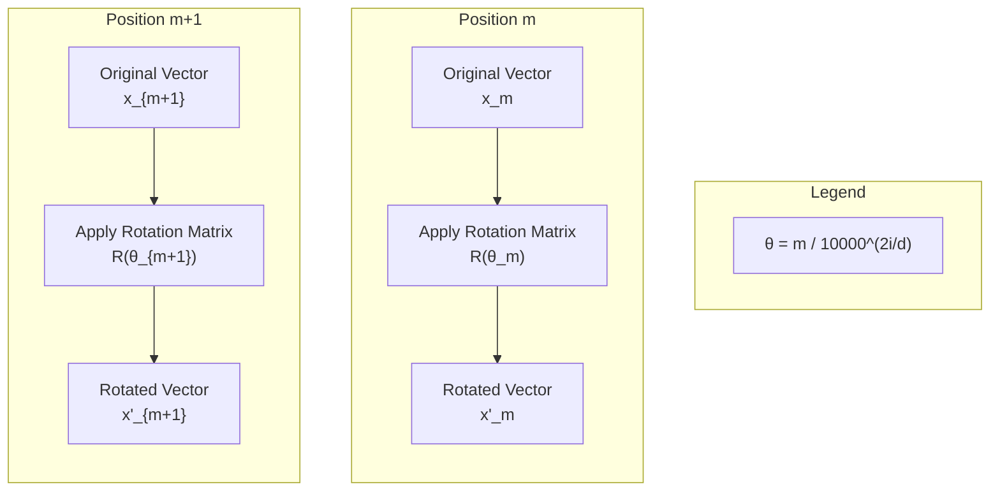
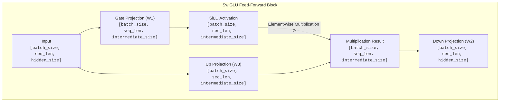
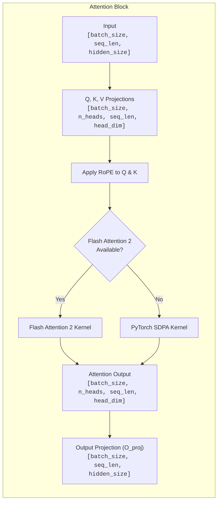
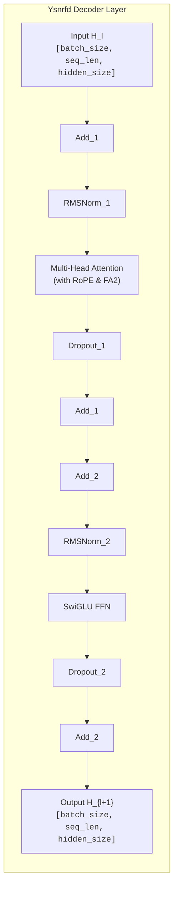
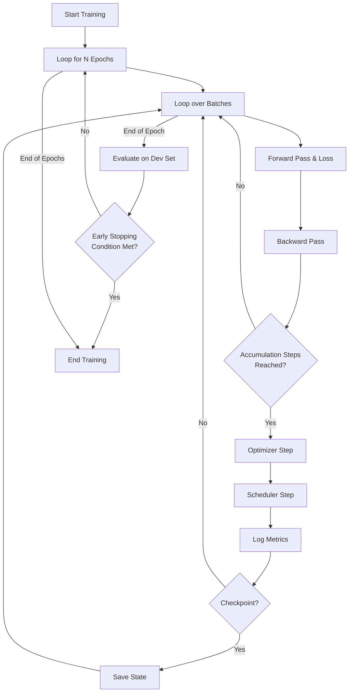
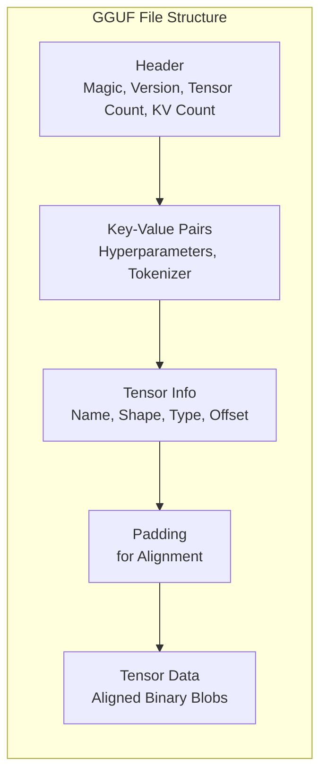

# The Ysnrfd Architecture: A Definitive Technical Specification

## Abstract
This document presents a comprehensive technical specification of **Ysnrfd**, a state-of-the-art, decoder-only transformer architecture engineered for high-performance causal language modeling. Ysnrfd synthesizes a curated set of the most effective advancements from contemporary research, including Root Mean Square Normalization (RMSNorm), Rotary Position Embeddings (RoPE), and the SwiGLU activation function. These components are integrated within a pre-normalization block structure, optimized for both computational efficiency and training stability. The architecture is designed with a hardware-aware philosophy, offering seamless support for memory-efficient mechanisms like Flash Attention 2 and deployment-friendly formats like GGUF. This guide provides an in-depth analysis of its mathematical foundations, componential design, and practical implementation, serving as the definitive reference for understanding and leveraging the full potential of the Ysnrfd architecture.

## 1. Philosophical Underpinnings and Design Rationale

The evolution of Large Language Models (LLMs) is characterized by a continuous pursuit of greater scale, efficiency, and performance. Ysnrfd is architected not as an incremental improvement, but as a holistic system addressing the core challenges of modern deep learning. Its design is governed by three foundational principles:

1.  **Efficacy over Novelty:** Ysnrfd prioritizes techniques with demonstrable, reproducible efficacy across diverse benchmarks and model scales. It eschews experimental, unproven methods in favor of a robust, well-understood foundation built upon the successes of its predecessors.
2.  **Hardware-Aware Design:** Every architectural decision is made with a keen awareness of its implications for hardware acceleration, particularly on modern parallel processors like GPUs. This is manifested in native support for memory-optimized attention kernels (Flash Attention 2) and quantization formats (GGUF) tailored for CPU inference.
3.  **Developer-Centric Ecosystem:** The architecture is designed to be a first-class citizen within the Hugging Face ecosystem. This ensures seamless interoperability with a vast suite of tools for tokenization, training, evaluation, and deployment, thereby significantly lowering the barrier to entry for researchers and engineers.

## 2. Macro-Architecture: A High-Level System View

Ysnrfd is an autoregressive transformer that processes a sequence of input tokens to generate a probability distribution over the subsequent token. The data flow is meticulously structured for parallel processing and efficient gradient propagation.

The following diagram illustrates the end-to-end forward pass, detailing the transformations of tensors at each stage.

## 3. Micro-Architecture: A Componential Analysis

The power of Ysnrfd lies in the sophisticated design of its core components. Each is selected to maximize performance, stability, and efficiency.

### 3.1 Normalization Strategy: A Deep Dive into RMSNorm

**The Problem:** Traditional Layer Normalization (LayerNorm) re-centers activations by subtracting the mean and scales by the variance. While effective, the mean-centering step can be computationally redundant and has been implicated in training instability in very deep networks.

**The Ysnrfd Solution:** Ysnrfd employs **Root Mean Square Normalization (RMSNorm)**, which simplifies the normalization process by solely re-scaling based on the root mean square of the activations, thereby omitting the mean-centering step.

**Mathematical Formulation:**
Given an input vector `x`, RMSNorm is defined as:
`RMSNorm(x) = (x / sqrt(mean(x^2) + ε)) * γ`
where `γ` is a learned weight vector and `ε` is a small constant for numerical stability.

**Benefits:**
*   **Computational Efficiency:** RMSNorm has been shown to be 7-40% faster than LayerNorm, directly contributing to faster training and inference.
*   **Training Stability:** By simplifying the normalization operation, it offers a more stable gradient flow in deep architectures.

### 3.2 Positional Encoding: The Elegance of RoPE

**The Problem:** Standard absolute position embeddings assign a fixed vector to each position. This can hinder the model's ability to generalize to sequence lengths not seen during training and does not inherently encode relative positional relationships.

**The Ysnrfd Solution:** Ysnrfd utilizes **Rotary Position Embeddings (RoPE)**. RoPE encodes absolute position information by applying a position-dependent rotation matrix to the query and key vectors within the attention mechanism. The relative positional relationships are then implicitly encoded in the dot product of these rotated vectors.

**Mathematical Formulation:**
For a 2D position `m` and a dimension `i` in the embedding space, the RoPE formula is:
`RoPE(m, i) = cos(m / 10000^(2i/d)) * x_i + sin(m / 10000^(2i/d)) * x_{i+d/2}`
where `d` is the dimension of the embedding. This is equivalent to rotating the vector `x` by an angle proportional to its position `m`.

**Benefits:**
*   **Relative Position Awareness:** Naturally incorporates relative position information.
*   **Extrapolation:** Improves performance on sequences longer than those seen during training.
*   **Parameter-Free:** Does not require additional trainable parameters.

**RoPE Visualization:**
The following diagram illustrates how RoPE applies a rotation to a 2D vector based on its position `m`.

### 3.3 Non-linearity and Capacity: The SwiGLU FFN

**The Problem:** Standard feed-forward networks with ReLU or GELU activations can become a bottleneck in terms of model capacity and expressive power.

**The Ysnrfd Solution:** Ysnrfd incorporates the **SwiGLU (Swish-Gated Linear Unit)** activation function. This more expressive activation uses a gating mechanism to dynamically control the flow of information.

**Mathematical Formulation:**
The SwiGLU activation is defined as:
`SwiGLU(x, W, V, W2) = Swish(xW) ⊙ (xV) W2`
where `Swish(x) = x * sigmoid(x)`, `W`, `V`, and `W2` are weight matrices, and `⊙` denotes element-wise multiplication.

**Benefits:**
*   **Increased Capacity:** Enhances the model's expressive power without a proportional increase in parameters.
*   **Improved Performance:** Empirically shown to improve performance across a variety of model sizes and tasks.

**SwiGLU Block Diagram:**

### 3.4 Attention Mechanism: Optimized Computation

**The Problem:** The standard attention mechanism has a quadratic time and memory complexity with respect to the sequence length (`O(N^2)`), making it computationally prohibitive for long sequences.

**The Ysnrfd Solution:** Ysnrfd defaults to PyTorch's highly optimized `scaled_dot_product_attention` (SDPA) and provides a seamless, native integration with **Flash Attention 2** when available.

**Scaled Dot-Product Attention:**
`Attention(Q, K, V) = softmax((QK^T) / sqrt(d_k)) V`
where `Q`, `K`, and `V` are the query, key, and value matrices, and `d_k` is the dimension of the keys.

**Flash Attention 2:** This groundbreaking algorithm computes attention without explicitly materializing the `N x N` attention matrix in memory. It uses tiling and recomputation to reduce memory usage from `O(N^2)` to `O(N)`, providing significant speedups and enabling much longer context windows.

**Attention Block Diagram:**

## 4. The Ysnrfd Decoder Layer: A Synthesis of Innovations

The `YsnrfdDecoderLayer` is the core computational unit that synthesizes all of the aforementioned innovations within a pre-normalization block structure. This diagram clearly shows the data flow and residual connections.

**Pre-Normalization vs. Post-Normalization:**
Ysnrfd adopts a **pre-normalization** scheme, which has been shown to be more stable for training deep models.

```mermaid
graph TD
    subgraph Post_Norm ["Original Transformer (Post-Norm)"]
        direction LR
        A1["Input x"] --> B1["Sub-Layer 1<br>e.g., Attention"];
        B1 --> C1["Add: x + Sub-Layer1(x)"];
        C1 --> D1["LayerNorm"];
        D1 --> E1["Sub-Layer 2<br>e.g., FFN"];
        E1 --> F1["Add: LayerNorm(x) + Sub-Layer2(x)"];
        F1 --> G1["LayerNorm"];
        G1 --> H1["Output"];
    end
    subgraph Pre_Norm ["Ysnrfd (Pre-Norm)"]
        direction LR
        A2["Input x"] --> B2["LayerNorm"];
        B2 --> C2["Sub-Layer 1<br>e.g., Attention"];
        C2 --> D2["Add: x + Sub-Layer1(Norm(x))"];
        D2 --> E2["LayerNorm"];
        E2 --> F2["Sub-Layer 2<br>e.g., FFN"];
        F2 --> G2["Add: x + Sub-Layer2(Norm(x))"];
        G2 --> H2["Output"];
    end
```

**Ysnrfd Decoder Layer Data Flow:**
This diagram shows the precise data flow within a single Ysnrfd decoder layer, combining pre-norm blocks with residual connections.

## 5. Training and Optimization Frameworks

The `ysnrfd.training.Trainer` class encapsulates a robust, production-ready training loop with support for advanced techniques.

**Training Loop Flowchart:**

## 6. Evaluation and Benchmarking

The `ysnrfd.evaluation.Evaluator` class provides a comprehensive suite for model assessment, including perplexity calculation and controlled text generation.

**Perplexity (PPL):**
The standard metric for language models, calculated as the exponential of the average cross-entropy loss over the evaluation dataset.
`PPL = exp(average_loss)`
A lower PPL indicates better predictive performance.

**Sampling Strategies:**
*   **Temperature:** Controls randomness. `>1.0` for creative output, `<1.0` for focused output.
*   **Top-k:** Limits selection to the `k` most probable tokens.
*   **Top-p (Nucleus Sampling):** Limits selection to the smallest set of tokens whose cumulative probability is greater than `p`.

## 7. Deployment and Quantization (GGUF)

Ysnrfd includes a native utility for converting models to the **GGUF** format. GGUF is designed for fast loading and efficient execution on CPUs, making it ideal for deploying large models on consumer hardware.

**GGUF File Structure:**

The `convert_to_gguf` utility meticulously handles each section, ensuring the output file is compliant and optimized for inference engines like `llama.cpp`.

## 8. Comparative Analysis and Design Rationale

This table compares Ysnrfd's design choices against other prominent architectures.

| Feature                  | Ysnrfd                  | Original Transformer | GPT-2                   | Llama 2                 |
| ------------------------ | ----------------------- | --------------------- | ----------------------- | ----------------------- |
| **Normalization**        | **RMSNorm**             | LayerNorm             | LayerNorm               | **RMSNorm**             |
| **Position Embedding**   | **RoPE**                | Absolute/Sinusoidal    | Learned Absolute        | **RoPE**                |
| **Feed-Forward**         | **SwiGLU**              | ReLU FFN              | GELU FFN                | **SwiGLU**              |
| **Attention**            | SDPA + **Flash Attn 2** | Standard Attention    | Standard Attention      | SDPA + **Flash Attn 2** |
| **Block Structure**      | **Pre-Norm**            | Post-Norm             | Pre-Norm                | **Pre-Norm**            |
| **GGUF Support**         | **Built-in**            | Community             | Community               | Community               |

**Rationale:** Ysnrfd adopts the most performant and efficient combination of these components, as validated by research and practice. The choice of RMSNorm, RoPE, and SwiGLU represents the current state-of-the-art in decoder-only LLM design.

## 9. Conclusion

Ysnrfd represents a sophisticated, modern, and highly practical approach to language modeling. By synthesizing a suite of proven architectural innovations with a focus on computational efficiency, training stability, and developer experience, it provides a powerful and robust platform for both research and production applications. This document has aimed to provide a complete and authoritative resource for understanding and leveraging the full potential of the Ysnrfd architecture.

---

# YSNRFD Architecture Flow

```mermaid
flowchart TB
 subgraph INPUTS["01 Raw Inputs"]
    direction TB
        A1["Input IDs tensor bsz x seq_len"]
        A2["Padding Mask bsz x seq_len 1 token 0 pad"]
        A3["Position IDs optional or auto generated"]
        EMBED["Token Embedding hidden_size"]
  end
 subgraph ROPE["02 Rotary Position Embedding System"]
    direction TB
        R1["Compute head_dim = hidden_size divided by num_heads"]
        R2["Compute theta frequencies"]
        R3["Generate freqs matrix max_pos x head_dim"]
        R4["Create embeddings pair repeated"]
        R5["cos cached buffer max_pos x head_dim"]
        R6["sin cached buffer max_pos x head_dim"]
  end
 subgraph MASKS["03 Decoder Mask Construction"]
    direction TB
        M1["Expand padding mask to 4D additive mask"]
        M2["Create causal look ahead mask 4D"]
        M3["Combine causal and padding masks"]
        n1["Untitled Node"]
  end
 subgraph MODEL["04 Ysnrfd Model"]
    direction TB
        LSTART["Loop over N decoder layers"]
        H0["Hidden States initial"]
        L_i["Each Decoder Layer"]
        LN_FINAL["Final RMSNorm"]
  end
 subgraph DEC_LAYER["05 Decoder Layer internals"]
    direction TB
        NORM1["RMSNorm before attention"]
        DL_IN["Layer input"]
        ATTBLOCK["ATTBLOCK"]
        RES1["Residual Add with dropout"]
        NORM2["RMSNorm before MLP"]
        MLPBLOCK["MLPBLOCK"]
        RES2["Residual Add with dropout"]
        DL_OUT["Layer Output"]
  end
 subgraph ATTBLOCK["06 Self Attention Block"]
    direction TB
        QPROJ["Q projection hidden_size to heads x head_dim"]
        KPROJ["K projection hidden_size to heads x head_dim"]
        VPROJ["V projection hidden_size to heads x head_dim"]
        QSHAPE["Reshape bsz, heads, seq, head_dim"]
        KSHAPE["Reshape bsz, heads, seq, head_dim"]
        VSHAPE["Reshape bsz, heads, seq, head_dim"]
        RQ["Apply RoPE to Query"]
        RK["Apply RoPE to Key"]
        ROPE_POS["position ids slicing cosine and sine"]
        PKV1["Concat with past key values or init"]
        PKV2["Concat with past value values or init"]
        ATT_CTRL{"FlashAttn2 available?"}
        FLASHATTN["FLASHATTN"]
        SDPA_AVAILABLE{"SDPA available?"}
        SDPA["SDPA"]
        STANDARD["STANDARD"]
        ATT_RAW["ATT_RAW"]
        ATTOUTPROJ["O projection"]
        ATT_FINAL["Attention Output"]
  end
 subgraph MLPBLOCK["07 SwiGLU Feed Forward Block"]
    direction TB
        W1["W1 Gate projection no bias"]
        W3["W3 Input projection no bias"]
        ACTIV["SiLU activation"]
        MUL["MUL Gate * Input"]
        W2["W2 Output projection"]
        MLP_OUT["MLP_OUT"]
  end
 subgraph LOSS["08 Loss Computation"]
    direction TB
        SHL1["Shift logits remove last token"]
        LOGITS["Logits bsz x seq_len x vocab_size"]
        SHL2["Shift labels remove first token"]
        CE["CrossEntropyLoss ignore index negative100"]
  end
 subgraph GENERATION["09 Generation Mode prepare inputs"]
    direction TB
        G1["If past exists use only last token"]
        G2["If first pass compute sequential position ids"]
        G3["Append ones to attention mask in generation"]
        G4["Return dict input ids position ids past kv attention mask"]
  end
 subgraph CACHE["10 Past Key Value Cache"]
    direction TB
        C1["past kv enabled? use_cache True"]
        C2["Store tuple key, value per layer"]
        C3["Keys and values grow each generation step"]
  end
    A1 --> EMBED & M2 & SHL2
    A2 --> M1
    M1 --> M3
    M2 --> M3 & n1
    EMBED --> H0
    H0 --> LSTART
    LSTART --> L_i
    L_i --> LN_FINAL
    LN_FINAL --> LM_HEAD["LM Head Linear hidden_size to vocab_size"]
    LM_HEAD --> LOGITS
    DL_IN --> NORM1
    NORM1 --> ATTBLOCK & QPROJ & KPROJ & VPROJ
    ATTBLOCK L_ATTBLOCK_RES1_0@--> RES1
    RES1 --> NORM2
    NORM2 --> MLPBLOCK & W1 & W3
    MLPBLOCK --> RES2
    RES2 --> DL_OUT
    QPROJ --> QSHAPE
    KPROJ --> KSHAPE
    VPROJ --> VSHAPE
    QSHAPE --> RQ
    KSHAPE --> RK
    A3 --> ROPE_POS
    ROPE_POS --> RQ & RK
    RQ --> PKV1
    RK --> PKV2
    PKV1 --> ATT_CTRL
    PKV2 --> ATT_CTRL
    ATT_CTRL -- yes --> FLASHATTN
    ATT_CTRL -- no --> SDPA_AVAILABLE
    SDPA_AVAILABLE -- yes --> SDPA
    SDPA_AVAILABLE -- no --> STANDARD
    FLASHATTN --> ATT_RAW
    SDPA --> ATT_RAW
    STANDARD --> ATT_RAW
    ATT_RAW --> ATTOUTPROJ
    ATTOUTPROJ --> ATT_FINAL
    W1 --> ACTIV
    ACTIV --> MUL
    W3 --> MUL
    MUL --> W2
    W2 --> MLP_OUT
    MLP_OUT --> MLPBLOCK
    LOGITS --> SHL1
    SHL1 --> CE
    SHL2 --> CE
    n2["YSNRFD ARCHITECTURE"]

    n2@{ shape: rounded}
    style n2 stroke-width:4px,stroke-dasharray: 0

    L_ATTBLOCK_RES1_0@{ animation: none }
```

